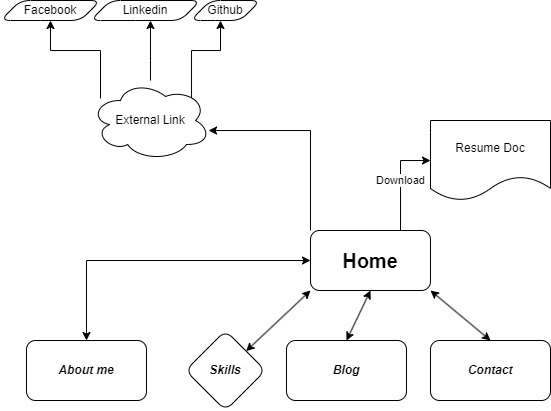
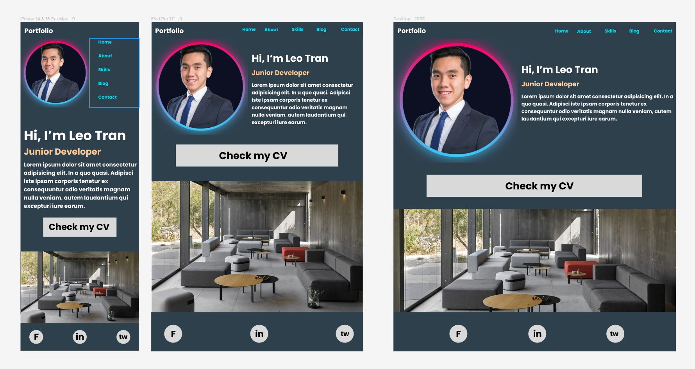
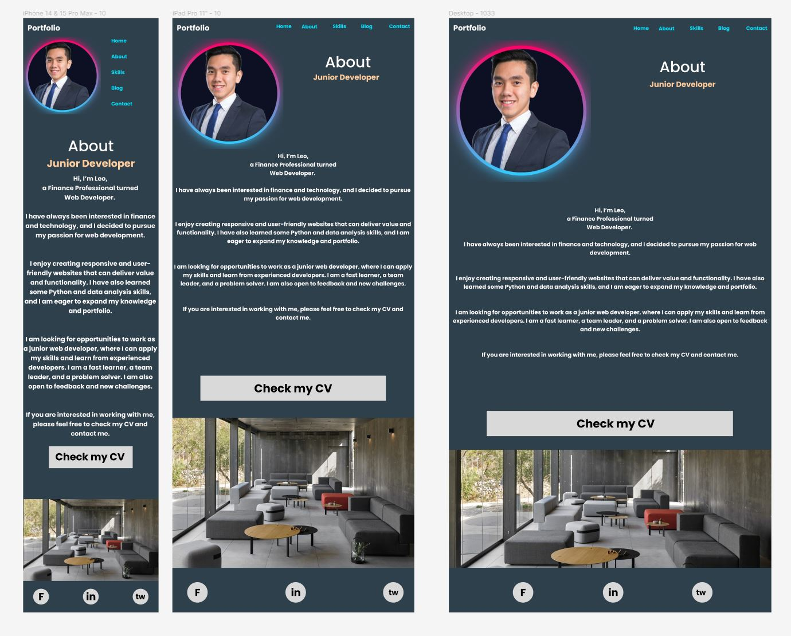
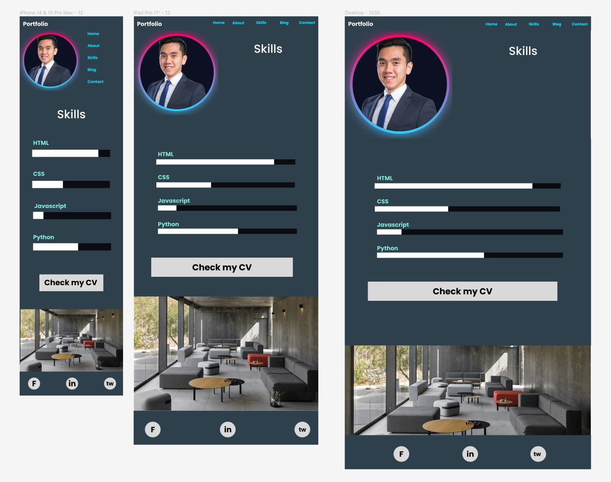
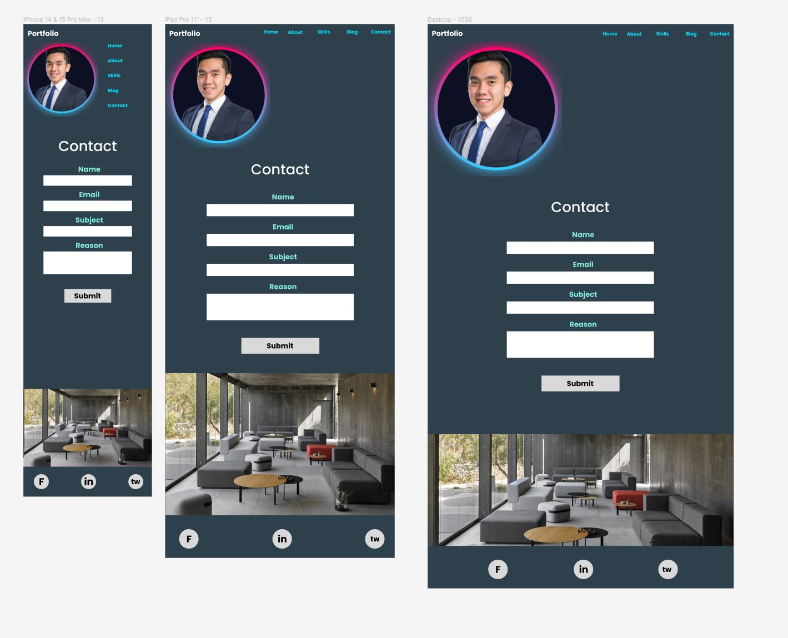

# README document

# T1A2 Portfolio Assignment
### Published Portfolio Website (URL link):

### Github Repo: https://github.com/leonardoXLT/XuanLapTRAN_T1A2

### Presentation Video:

## 1. Purpose 

The main purpose of this portfolio website is to achieve two things:

- To explore and express my own design/web development styles.

- To present my background, skills, and experience in web development and design.

The website also aims to network with others: prospective employers and other aspiring developers. I hope to showcase my personality and interests, as well as receive feedback and opportunities.

## 2. Functionality / features

## 3. Sitemap

## 4. Screenshots

### Home page

### About

### Skills

### Blog

### Contact

## 5. Target audience

* Primarily for - Potential Employers
* Secondary - Friends and Family
* Secondary - Current Work colleagues

note: secondary target audience would be for referral of work or pure enjoyment.

## 6. Tech Stack

* HTML
* CSS
* SCSS

* app.diagrams.net
* Figma

* coolors.co
* [Canva Color Palettes](https://www.canva.com/colors/color-palettes/)
* Pinterest

* Visual Studio Code

* Github
* Netlify

### 7. Disclosure: idea reference

###### Homepage layout and animation: https://www.youtube.com/watch?v=k3F1PyBX8pI&list=PL04HhjGyUuvV7XzVa4pNqCXkPo1QlFq4y&index=65

###### Skill bar animation: https://www.youtube.com/watch?v=EoN_4fv3T7A&t=194s

###### Footer, contact form: Coder Academy

##### Comments: I am happy with 90% of the portfolio website, I know I can do better (blog page layout, grid, a more responsive nav-bar, contact form, etc.)